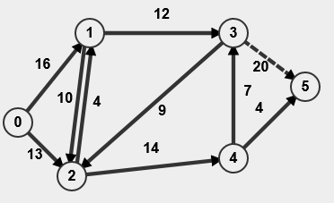

# GoldbergHaskell
Haskell implementation of the Goldberg push-relabel maximum flow algorithm with always select the highest node strategy.

# Overview
It's an algorithm returning maximum flow for the given flow network `F = (V, E, s, t, c)`, where `V` is set of graph vertices, `E` are edges, `s` is special **source** vertex, `t` is a special **terminal** vertex and `c` is **capacity function** that for each edge assigns its capacity. This algorithm is thoroughly described in the book [Průvodce labyrintem algorithmů](http://pruvodce.ucw.cz/) in the chapter "Goldbergův algorithmus" by *Martin Mareš* and *Tomáš Valla*.

Our implementation will take an approach called **highest-label** where in each iteration, whenever we take the next active node, we always choose the one with the **highest label** (also called height). We achieve this by storing a list of "buckets", one for each height and we will assign nodes in their corresponding buckets.

# How to build
You need GHC(i) toolchain (or any other Haskell platform) to run this. Provided sources do not have any `main` funcion. In order to test them, please use the interactive version GHCi:
```
# Open the interpret and load the `tests.hs` file
ghci ./tests.hs
```

# Testing data
The main algorithm logic is in the `goldberg.hs` file. 

Testing functions are in `tests.hs` where you can use predefined networks (that are generated in the file `testingNetworks.hs` from the source JSON networks in `testing_data/networks/`).

Those networks are bound to variables `net1` - `net5`, that you can use.

Good starting points are:
- `testGoldberg` - It runs the algorithm on all the predefined networks - shows expected and real flow values.
- `testGoldbergNet1`,  `testGoldbergNet2`, ... - Runs the algorithm on the specified network and returns it (you can pPrint the final flow using funciton `pPrintFlow`)
- You can, of course, define your own network and run it. Example function how you can do it is `testCustomNet`, `testCustomNetFlowVal` and `testCustomNetFlow`.

### Testing networks
#### net1

#### net2

#### net3

#### net4

#### net5


# How to use
```
# Suppose we have a variable with network defined `network`
network = ...

# Call the algorithm (this returns the updated network)
maxFlowNetwork = runGoldberg network

# To get the max flow value
getNetworkFlow $ runGoldberg network

# To print the flow
pPrintFlow $ runGoldberg network
```


# Developer documentation
## Implementation:
The algorithm is run by the function `runGoldberg` and is divided into two main phases:
  
  1) `goldbergInitialize` - Initializes the heights and sends the first preflow (wave) from the SOURCE vertex.
  2) `goldbergStep` - One iteration of the algorithm that is repeated while there are some ACTIVE VERTICES. This is then divided into two main sub-functions that are called based on the state of the currently selected active vertex (always the one with the highest height)
     1)  `push` - Pushes the maximum flow using the current excess through the provided edge.
     2)  `liftVertex` - Increases the height of the vertex and updates the descending edges for each vertex.
  
Many of the mentioned functions also call some helper functions, but those above mentioned are the key functions to look at when inspecting the algorithm. These above mentioned also correspond to how the pseudocode of the Golberg algorithm is structured.

## Data types (defined in `types.hs`):
### User input/output types
- `V` - Vertex as taken from the user.
- `E` - Edge as taken from the user.
- `N` - Network as taken (and also returned to) from the user.

### Types used for algorithm computation
- `VertId` - Identifier for vertices.
- `Vertex` - Vertex with additional meta-data essential for the algorithm.
- `Edge` - Edge with additional meta-data essential for the algorithm.
- `Network` - Flow network with additional meta-data essential for the algorithm.

For more information, please use comments directly inside the source files.